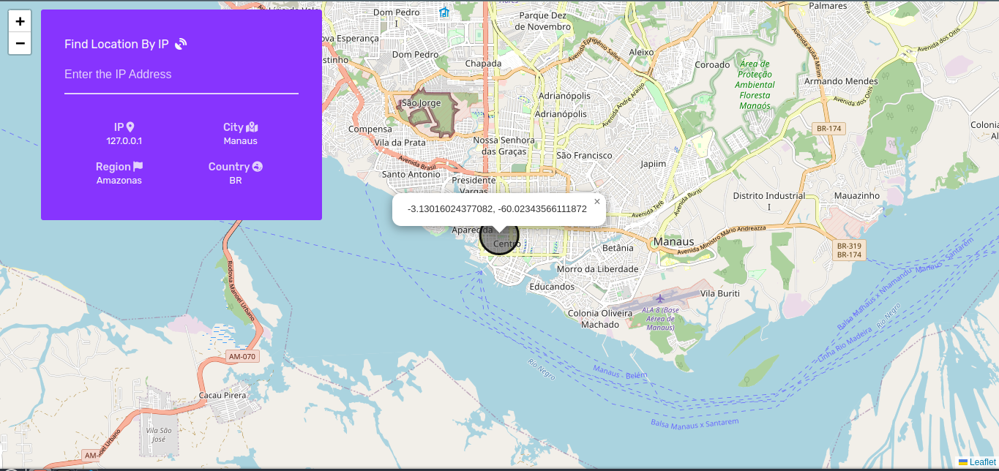

#### Find location by IP 🔎

 

<p>Projeto web desenvolvido com objetivo de localizar coordenadas pelo endereço IP.</p>

<p>O site foi desenvolvido baseado em parte de um projeto proposto na plataforma <a href="https://www.frontendmentor.io/challenges/ip-address-tracker-I8-0yYAH0"><b>Frontend Mentor</b></a></p>



#### Executando ⚙️

```sh
# Website: https://findlocationbyip.netlify.app/

# Clone
$ git clone https://github.com/EricNeves/findLocationByIP.git

# Install Dependencies
$ cd findLocationByIP && npm install

# Execute
$ npm start
# Run mode development 
$ npm run dev
# Build
$ npm run build
```

#### Ferramentas 🛠

   * HTML5
   * CSS3
   * Javascript
     * Fetch [<a href="https://leafletjs.com/">LeafletJS</a>, <a href="https://www.ipify.org/">IPIFY API</a>]
   * NodeJS
     * Express
     * Webpack
     * Babel

#### License 📝

