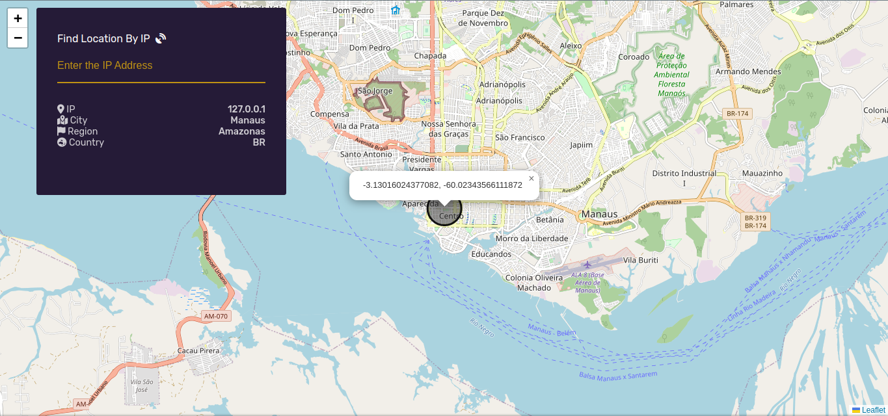

#### Find location by IP 🔎

 

<p>Projeto web desenvolvido com objetivo de localizar coordenadas pelo endereço IP. Foram implentadas e utlizadas duas APIs (<a href="https://leafletjs.com/">LeafletJS</a>, <a href="https://www.ipify.org/">IPIFY API</a>), para pegar a posição (<b>Latitude e Longitude</b>) e renderizar no mapa. Além do mais, foram inseridas ferramentas como Webpack, Babel, Dotenv e entre outras.</p>

<p>O site foi criado baseado em parte de um projeto proposto na plataforma <a href="https://www.frontendmentor.io/challenges/ip-address-tracker-I8-0yYAH0"><b>Frontend Mentor</b></a>.</p>



#### Observações❗️

<p>Para que o website seja executado em sua máquina, é preciso fazer um cadastro em <a href="https://www.ipify.org/">IPIFY API</a> e copiar a chave de acesso (<b>ApiKey</b>) para posteriormente ser utilizada na aplicação.</p>

<p>Partindo deste ponto, edite o arquivo <b>.env.example</b> para <b>.env</b> e cole a chave de acesso em KEY_IPIFY_API. Feito isso, o sistema funcionará perfeitamente.</p>

#### Executando ⚙️

```sh
# Website: https://findlocationbyip.netlify.app/

# Clone
$ git clone https://github.com/EricNeves/findLocationByIP.git

# Install Dependencies
$ cd findLocationByIP && npm install

# Execute
$ npm start
# Run mode development 
$ npm run dev
# Build
$ npm run build
```

#### Ferramentas 🛠

   * HTML5
   * CSS3
   * Javascript
     * Fetch [<a href="https://leafletjs.com/">LeafletJS</a>, <a href="https://www.ipify.org/">IPIFY API</a>]
   * NodeJS
     * Express
     * Webpack
     * Babel

#### License 📝

